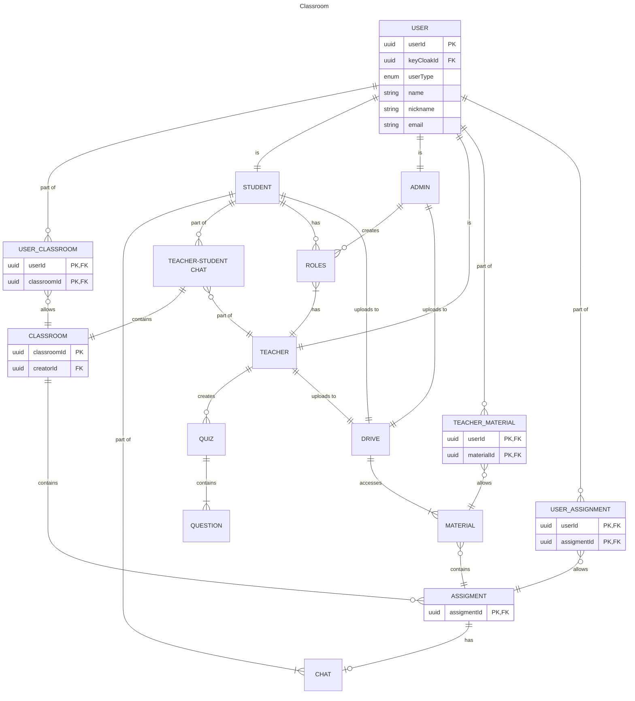

```mermaid
---
title: Classroom
---

erDiagram
    USER ||--o{ USER_CLASSROOM : "part of"
    USER_CLASSROOM }o--|| CLASSROOM : allows
    USER ||--|| STUDENT : is
    USER ||--|| ADMIN : is
    USER ||--|| TEACHER : is

%%    TEACHER }o--o{ CLASSROOM : creates
    TEACHER ||--o{ QUIZ : creates
%%    TEACHER }o--o{ ASSIGMENT : makes
    ROLES }|--|| TEACHER : has

    QUIZ ||--|{ QUESTION : contains

%%    STUDENT }o--o{ ASSIGMENT : gets

    "TEACHER-STUDENT CHAT" ||--|| CLASSROOM : contains

    MATERIAL }o--|| ASSIGMENT : contains
    DRIVE ||--|{ MATERIAL : accesses

%%    STUDENT }o--o{ CLASSROOM : "part of"
    "TEACHER-STUDENT CHAT" }o--|| TEACHER : "part of"
    CLASSROOM ||--o{ ASSIGMENT : contains

    ASSIGMENT ||--o| CHAT : has
    STUDENT ||--|{ CHAT : "part of"

    STUDENT ||--o{  "TEACHER-STUDENT CHAT" : "part of"
    STUDENT ||--o{ ROLES : has

    STUDENT ||--|| DRIVE : "uploads to"
    TEACHER ||--|| DRIVE : "uploads to"
%%    TEACHER }o--o{ MATERIAL : makes
    ADMIN ||--o{ ROLES : creates
    ADMIN ||--|| DRIVE : "uploads to"

    USER ||--o{ TEACHER_MATERIAL : "part of"
    TEACHER_MATERIAL }o--|| MATERIAL : allows

    USER ||--o{ USER_ASSIGNMENT : "part of"
    USER_ASSIGNMENT }o--|| ASSIGMENT : allows


%% Connection tables
    USER_CLASSROOM {
        uuid userId PK, FK
        uuid classroomId PK, FK
    }

    USER_ASSIGNMENT {
        uuid userId PK, FK
        uuid assigmentId PK, FK
    }

    TEACHER_MATERIAL {
        uuid userId PK, FK
        uuid materialId PK, FK
    }


%% Definitions of attributes
    USER {
        uuid userId PK
    %% TODO figure out what keycloak gives as an identifier
        uuid keyCloakId FK
        enum userType
        string name
        string nickname
        string email
    }

    TEACHER {
    %% uuid userId FK
    }

    CLASSROOM {
        uuid classroomId PK
        uuid creatorId FK
    }

    ASSIGMENT {
        uuid assigmentId PK, FK
    }
```