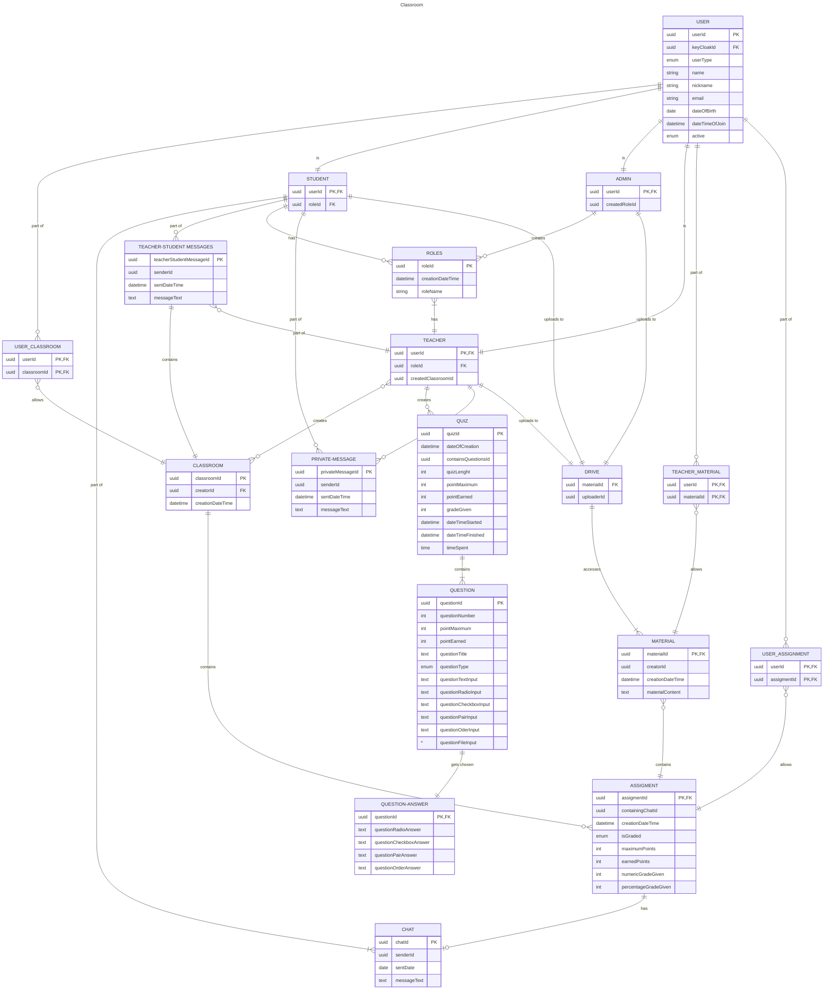

```mermaid
---
title: Classroom
---

erDiagram
    USER ||--o{ USER_CLASSROOM : "part of"
    USER_CLASSROOM }o--|| CLASSROOM : allows
    USER ||--|| STUDENT : is
    USER ||--|| ADMIN : is
    USER ||--|| TEACHER : is

    TEACHER }o--o{ CLASSROOM : creates
    TEACHER ||--o{ QUIZ : creates
%%    TEACHER }o--o{ ASSIGMENT : makes
    ROLES }|--|| TEACHER : has

    QUIZ ||--|{ QUESTION : contains
    QUESTION ||--|| "QUESTION-ANSWER": "gets chosen"

%%    STUDENT }o--o{ ASSIGMENT : gets

    "TEACHER-STUDENT MESSAGES" ||--|| CLASSROOM : contains

    MATERIAL }o--|| ASSIGMENT : contains
    DRIVE ||--|{ MATERIAL : accesses

%%    STUDENT }o--o{ CLASSROOM : "part of"
    "TEACHER-STUDENT MESSAGES" }o--|| TEACHER : "part of"
    CLASSROOM ||--o{ ASSIGMENT : contains

    ASSIGMENT ||--o| CHAT : has
    STUDENT ||--|{ CHAT : "part of"

    STUDENT ||--o{  "TEACHER-STUDENT MESSAGES" : "part of"
    STUDENT ||--o{ ROLES : has

    STUDENT ||--o{ "PRIVATE-MESSAGE": "part of"
    TEACHER ||--o{ "PRIVATE-MESSAGE": "part of"

    STUDENT ||--|| DRIVE : "uploads to"
    TEACHER ||--|| DRIVE : "uploads to"
%%    TEACHER }o--o{ MATERIAL : makes
    ADMIN ||--o{ ROLES : creates
    ADMIN ||--|| DRIVE : "uploads to"

    USER ||--o{ TEACHER_MATERIAL : "part of"
    TEACHER_MATERIAL }o--|| MATERIAL : allows

    USER ||--o{ USER_ASSIGNMENT : "part of"
    USER_ASSIGNMENT }o--|| ASSIGMENT : allows


%% Connection tables
    USER_CLASSROOM {
        uuid userId PK, FK
        uuid classroomId PK, FK
    }

    USER_ASSIGNMENT {
        uuid userId PK, FK
        uuid assigmentId PK, FK
    }

    TEACHER_MATERIAL {
        uuid userId PK, FK
        uuid materialId PK, FK
    }


%% Definitions of attributes
    USER {
        uuid userId PK
    %% TODO figure out what keycloak gives as an identifier
        uuid keyCloakId FK
        enum userType
        string name
        string nickname
        string email
        date dateOfBirth
        datetime dateTimeOfJoin
        enum active
    %% active = just like on discord, so the teachers can spy on the students if they're doing their work in class or just scrolling through TikTok
    }

    TEACHER {
        uuid userId PK, FK
        uuid roleId FK
        uuid createdClassroomId

    }

    CLASSROOM {
        uuid classroomId PK
        uuid creatorId FK
        datetime creationDateTime
    }

    ASSIGMENT {
        uuid assigmentId PK, FK
        uuid containingChatId
        datetime creationDateTime
        %% i have aneurysm
        enum isGraded
        int maximumPoints
        int earnedPoints
        int numericGradeGiven
        int percentageGradeGiven

    }

%% basic chatting attributes, can add more in the future 
    CHAT {
        uuid chatId PK
        uuid senderId
        date sentDate
        text messageText
    }

    ADMIN {
        uuid userId PK, FK
        uuid createdRoleId
    %% the admin creates a role and gets the id back in order to determine which admin created the role. i guess
    }

    STUDENT {
        uuid userId PK, FK
        uuid roleId FK


    }

    "TEACHER-STUDENT MESSAGES" {
        uuid teacherStudentMessageId PK
        uuid senderId
        datetime sentDateTime
        text messageText
    }

    ROLES {
        uuid roleId PK
        datetime creationDateTime
        string roleName
    %% idk about these
    }


    DRIVE {
        uuid materialId FK
        uuid uploaderId

    }

%% idk how file upload works, so I'll just give it a text attribute. needs changing
    MATERIAL {
        uuid materialId PK, FK
        uuid creatorId
        datetime creationDateTime
        text materialContent
    }

%% added this table because you wanna dm the teacher
    "PRIVATE-MESSAGE" {
        uuid privateMessageId PK
        uuid senderId
        datetime sentDateTime
        text messageText
    }

    QUIZ {
        uuid quizId PK
        datetime dateOfCreation
        uuid containsQuestionsId
        int quizLenght
        int pointMaximum
        int pointEarned
        int gradeGiven
        datetime dateTimeStarted
        datetime dateTimeFinished
        time timeSpent
    }

    QUESTION {
        uuid questionId PK
        int questionNumber
        int pointMaximum
        int pointEarned

        text questionTitle
        enum questionType
        text questionTextInput
        text questionRadioInput
        text questionCheckboxInput
        text questionPairInput
        text questionOderInput
        * questionFileInput
    %% * = idk how this  works
    }

    "QUESTION-ANSWER" {
        uuid questionId PK, FK

    %% text doesn't need answer
        text questionRadioAnswer
        text questionCheckboxAnswer
        text questionPairAnswer
        text questionOrderAnswer
    %% file doesn't need answer
    }

```