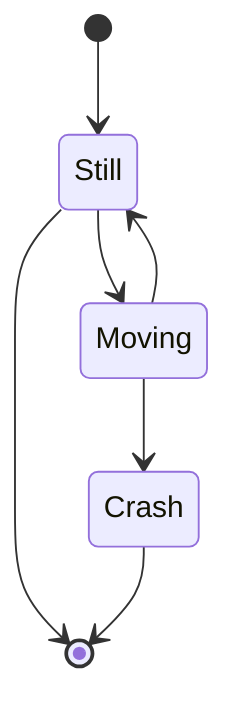
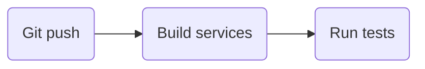
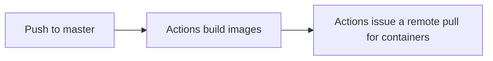
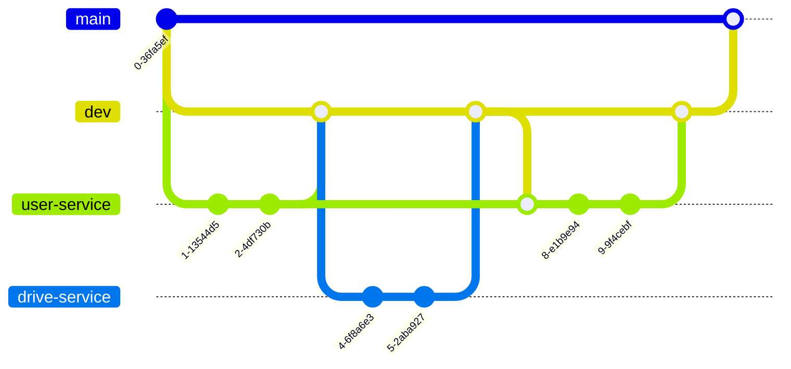

# LearningPulse software surface level documentation

> **❗ Important!**  
> This documentation may change in the future.

# Abstract

_[go to top](#contents)_

Learning Pulse is an innovative learning platform that blends the strength of Redmenta and Google Classroom to create a collaborative educational environment.
The objective is to provide a comprehensive feature package, aiming to incorporate as many elements as possible while maintaining focus on stability and ease-of-use. LearningPulse features interactive quizzes, dedicated classrooms and assignments, material uploads, designated study and file-sharing drives for students, and administrator panels.

# Feature set

_[go to top](#contents)_

## Classroom


When the end-users enter the application they will be greeted with a classroom join-prompt. After signing up for a classroom, they will become the students of it. By being a member, they will be able to see all the materials, quizes, and files the teacher (the creator and manager of the classroom) uploads in it. Later, the teacher will be able to give marks on the assignment they gave out by using points. 

### Assignments

#### Single

Students are assigned assignments by the teacher in this classroom which they have to fill out by a certain deadline. They can attach any type of document, file or code from their own drive, or complete the quiz the teacher may give out.

#### Cooperative

These assignments can also be tagged with `cooperative` tag meaning teachers can assign multiple people to one assignment where they have to work together on one shared project. All students can see their own teammates and open up a chat window to discuss the project.

### Class documents/materials

Teachers may submit work papers or any other material that students may need to enchant their learning with. These can be document files, programs or any media file. Students can view them straight from the application.

### Teacher chat

Students may direct message their teachers inside the class. They can ask for help or link any document from their drive/ the classes documents. They may also attach any kind of media file in that chat window

### Marking

Each and every assignment will have an option to be marked as "Graded". With picking this option, the teacher will be able to give points and marks for the students' work, and then grade them. The amount of point the teacher can give out will be entirely dependent on the teacher. After the teacher grades the assignent (or if the assgnment was a quiz, the teacher can even import the points from the completed quizes and set them as the actual points for the grading) the system will give out a percentage and based on that the system will automatically assign a grade for that assignment. Also, the teacher will be able to change the interval the grades are set in.

# Quiz

_[go to top](#contents)_

Teachers can creater quizzes that students may fill out as many times as the teache sets the maximum amount for filling out. The tests are server-side only and students may only know the answer for them upon finishing them. Showing the correct answers after the test can also be disabled by the teacher to prevent cheating. 

## Question types

- ### Text input

  A basic text input field with a title for the question. A character or word limit can also be set. 

  **Rewarding:**  
  Depends. The teacher may give the field a maximum achievable point that user can see when filling out. Then after the test is sent in teachers may grade accordingly.

- ### Basic select

  A list of radio buttons are shown where only one may be selected.  

  **Rewarding:**  
  One point by default, can be modified by the teacher.

- ### Complex select

  A list of checkboxes are show where multiple (or all) can be selected at once.
  The creator of the quiz may also create limits on the concurrent selections. 

  **Rewarding:**  
  As many points as many good answers.

- ### Pair match

  An even or odd number of cards are given that can either be an image or text. Or vise versa. Not every card has to be paired, there can be bonus cards.
  The user has to pair these cards. The order does not matter only if they match.

  **Rewarding:**  
  One point for each right selected pair by default, can be modified by the teacher.

- ### Ordering

  A list of cards of texts are shown, the user has to order them from top to bottom, or bottom to top, according to the teacher's instructions.

  #### Rewarding:

  One point for every correctly ordered card by default, can be modified by the teacher.

- ### File upload(s)

  A field where users can select file(s) from their own drive or conputer and upload them to the question.

  Automatic evaluation is not possible with this type of question.

  #### Rewarding:

  Entirely dependent on the teacher's personal evaluation. They will have to decide if the work is adequate of the constrains the teacher has set or not.


## Role

Roles like what discord has will be implemented too. Basically administrators can create roles and assign it to members of LearningPulse.  
Roles will have permissions that provide users with abilities to do certain actions.
This will be achieved using the OpenId specification.

Examples:  
`learningpulse.administrator` - Administrator privileges, overwrites all and has permission to do anything  
`learningpulse.classes.edit` - Allows the role to edit any class.  
`learningpulse.quizes.view` - Allows the role to view any quiz.

## Drive

Each user, including teachers will have their own drive where they can upload any kind of file which they may share with other users on the platform. For the sake of less complications S3 storage will be used to build this part of the project.  
This feature neatly integrates with the [classroom](#classroom) and the [quiz](#quiz) part of the program. Students can attach files to quizzes, classwork's from here.  
It also allows for collaborative work where users can use fully fledged office suite's to edit their documents inside the browser.

# Frontend

_[go to top](#contents)_

The frontend of the project will be built using React as its one of the most popular and stable Javascript frameworks out there. The frontend will be 50%/50% client and server side rendered using Next.js, not only because of this, but also because of it's high quality and optimization.

## Themes

The frontend will allow users to select from a curated list of themes, making the application highly customizable, while keeping the ease-of-use at high priority, so our users can feel right at home. An example of the few themes LearningPulse will come with.

- [Windows 95](https://github.com/themesberg/windows-95-ui-kit)
- [Neumorphism](https://demo.themesberg.com/neumorphism-ui/)
- [Material](https://getbootstrap.com/)

## Wireframing

Wireframing involves creating a visual guide that represents the skeleton framework of our frontends.


# Server

## Backend

_[go to top](#contents)_

The server will be written in Java more precisely SpringBoot. It will be broken down to microservices for easy _vertical_ scaling.  
Vertical scaling also allow for redundancy and 99.99% uptime as services can be updated one by one, or updates can be pushed accordingly so that inactive nodes will get the release version and get prioritized. Then older nodes will eventually die off and get updated.

## Authentication

Considering the nature of our project it is extremely important to make authentication as secure as possible, although it's debatable if it's as importand as at a Banking service for example. Still, security around auth is one of the most basic services.

And as such, for authentication Keycloak will be used to minimize security holes, as it's open-source, extensible, performant, and customizable.

## Data storage

Our objective with data storage was to provide a safe, reliable, and well performing method of storing data, which is not only a must have, but is also one of the elementary requirements for any project - let it be small or big - with more complex data handling. Knowing this, PostgreSQL caught our eye, whlist not only meeting our demands for standards, but also having a strong reputation for itself.

We truly think that with this ORDBMS (object-relational database management system), we chose adaquate considering the competition of DBM systems.

For object storage S3 [garage](https://garagehq.deuxfleurs.fr/) will be used considering it's geo-located property and ease of use.

## Load balancing

With load balancing we wanted to go with something that had high reliability, stability, and also ease-of-use. That is exactly why Kubernetes caught our eye in distributing load along the nodes, meeting every standard point that we had in mind,.

# Versioning

[Semantic versioning](https://semver.org/) will be used to version the software, making our life probably 10 times easier as software devs. We chose this, as it is one of the most popular and humanly readable versioning system out there.

> :information_source: **Example**:  
> Once someone commits a new update that causes older API's/features to break the [`MAJOR`](https://devhints.io/semver) tag has to be changed accordingly.

```
v1.2.43
commit - d71bb0e9d3 - refactor api
v2.0.0
```

# Documentation

Documenting software is key to an open-source project like this. Each class, method and implementation will and have to be documented.

Documentation will be approached in a similar fashion as development; it will be vertically segmented instead of horizontally. Each feature or part of the project will be documented at the same time rather than split into the database-backend-frontend model, eg: the `classroom` feature's database-backend-frontend will be thought out in the same timeframe.

## Server

Javadoc will be used to generate the documentation for each class and their inherited methods and so on.

For the API part, thankfully SpringBoot has a swagger documentation plugin that can auto-generate it on the go based on beans.

**Example**  
 Here is a class that has requirements defined for its fields.

```java
@Entity
public class User {
    //...

    @NotNull(message = "First Name cannot be null")
    private String firstName;

    @Min(value = 15, message = "Age should not be less than 15")
    @Max(value = 65, message = "Age should not be greater than 65")
    private int age;
}
```

**Output**  
When the API docs is generated these requirement will carry over to the swagger ui where users can see the requirements.


Similar to the frontend, this is a way to describe docs for a function.

```java
/**
* Returns an Image object that can then be painted on the screen.
* The url argument must specify an absolute <a href="#{@link}">{@link URL}</a>. The name
* argument is a specifier that is relative to the url argument.
* <p>
* This method always returns immediately, whether or not the
* image exists. When this applet attempts to draw the image on
* the screen, the data will be loaded. The graphics primitives
* that draw the image will incrementally paint on the screen.
*
* @param  url  an absolute URL giving the base location of the image
* @param  name the location of the image, relative to the url argument
* @return      the image at the specified URL
* @see         Image
*/
public Image getImage(URL url, String name) {
  try {
    return getImage(new URL(url, name));
  } catch (MalformedURLException e) {
    return null;
  }
}
```

## Testing

For the testing we decided on JUnit, as it simply met our standards, making testing on quote: "programmer-friendly". It was designed to test Java and JVM. Also it is one of the most popular and better frameworks for testing Java.

```java
public class UserServiceTests {

    @Test
    public void TestUserPermissions() {
        User user = new User();
        // testing done here
    }
}
```

# Frontend

Documenting the frontend of the project can be quite tricky, making our already miserable life even more miserable (joke). We will be working hard on making sure that every important aspect of the frontend is well-documented, and written down.

**For methods and classes, JSDoc for typescript is the perfect fit.**

```typescript
/**
 * @param {number}  number - The number we want to check if is prime
 * @returns {boolean} Return value
 */
function is_even(number): boolean {
  if (number % 2 == 0) {
    return true;
  }
  return false;
}
```

**For user action descriptions and flow charts [Mermaid](https://github.com/mermaid-js/mermaid) has to be used.**  
 We can describe actions that are then generated into SVGs, PNGs, or other formats. It also neatly integrates into Forgejo.

_An example of a state description_

Raw

```
stateDiagram-v2
    [*] --> Still
    Still --> [*]
    Still --> Moving
    Moving --> Still
    Moving --> Crash
    Crash --> [*]
```

Output



## Testing

It is also important to test the Javascript part of the project. For that we decided on using [Jest](https://jestjs.io/docs/getting-started) (jestjs) as it's easy and simple to use, as well as it's one of the most popular Javascript frameworks for testing the language. The framework is well-documented (just as we wish our project would be) and it also provides some extra statistics for the ones who need it.

Example:

1. Define the test in `tests/test.ts`

```typescript
// tests/testClass.ts
function sum(a, b) {
  a + b;
}

test("adds 1 + 2 to equal 3", () => {
  expect(sum(1, 2)).toBe(3);
});
```

2. Run test

```bash
npm test
```

# Development

## CI _Continuous Integration_

Continuous integration allows us to take development to the next with automated building.
~~Github~~ forgejo actions will be used to compile a docker images of each service then uploaded to the image registry of our own forgejo instance. This can later co-op with _CD_ to automatically deploy to our test servers and later even production.



## CD _Continuous Delivery_

After images are built, they need to be deployed to some server for e2e and unit testing. Instead of us going thru all the servers and manually pulling the latest images, docker compose webhooks can be used to trigger the pull.



## Git _Version control_

Since developers will choose their own features they want to implement, **creating a new branch for that feature, and developing there is a must!** By default if any other features get implemented into the main developer branch,that feature will need to be pulled and merged into the other development branch.  
After the feature is stable and working and tested, the owner of that feature will create a pull request and merge into the `main` branch.  
For pull request to be pulled into the developer branch, at least two people in the project have to review the code and approve it. If the code is not fitting for a member an issue can be raised to fix x y part of the code. Then the request can be review once again
An example of this process:



## Developer shells using _nix_

A root `flake.nix` is included with the project to ensure that all of our developers use the same version of java, nodejs and other miscellaneous development tools. Flakes also allow us to easily reproduce the same errors on every type of machine.

# Staging

_[go to top](#contents)_

In this section the documentation will explain how the application will be built over its lifetime. As this is a massive project, developers need to think thru their decisions on choosing the features and technologies which the application will be built upon. Since LearningPulse will employ many features it's only one way to get started. And that is to start with the bear minimum to get the foundation laying.

## Alpha

The alpha version of LearningPulse is basically the Minimum Viable Product.  
Only certain, let's call them core features will be implemented.  
These include the following:

- [Classroom](#classroom)
- [Quiz](#quiz)
